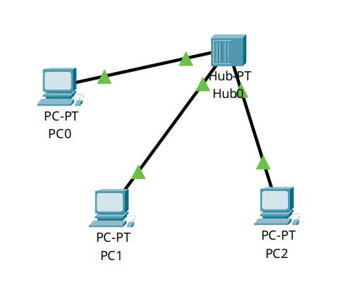
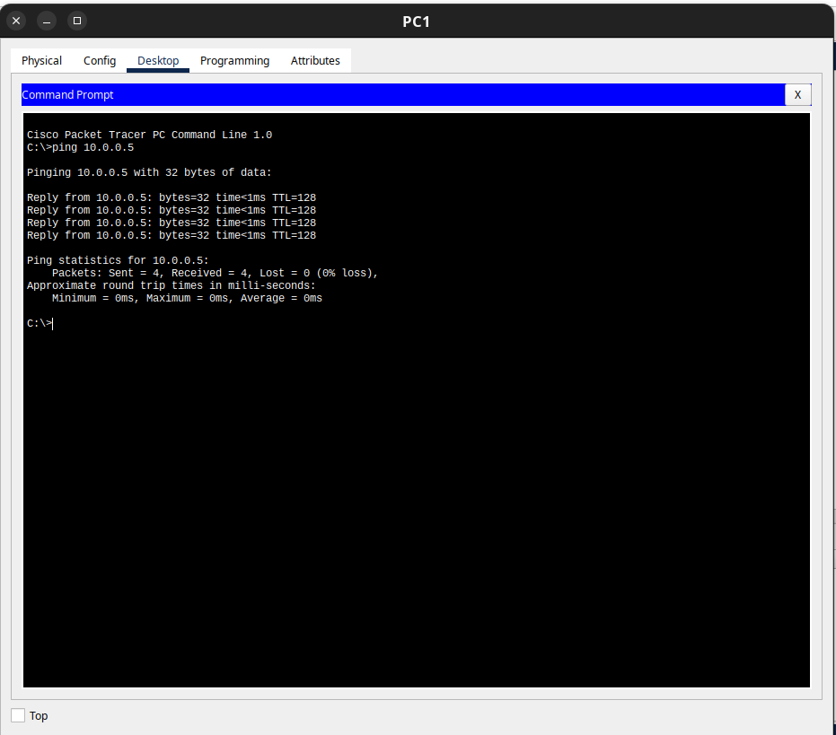
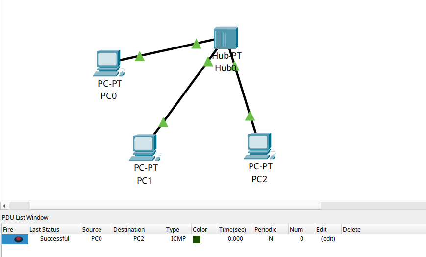
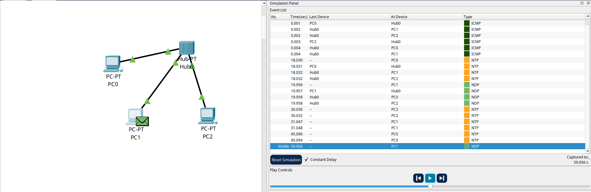
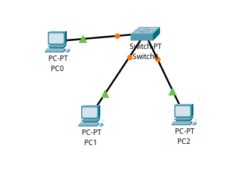
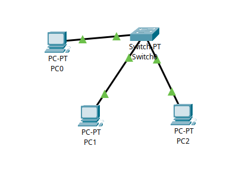
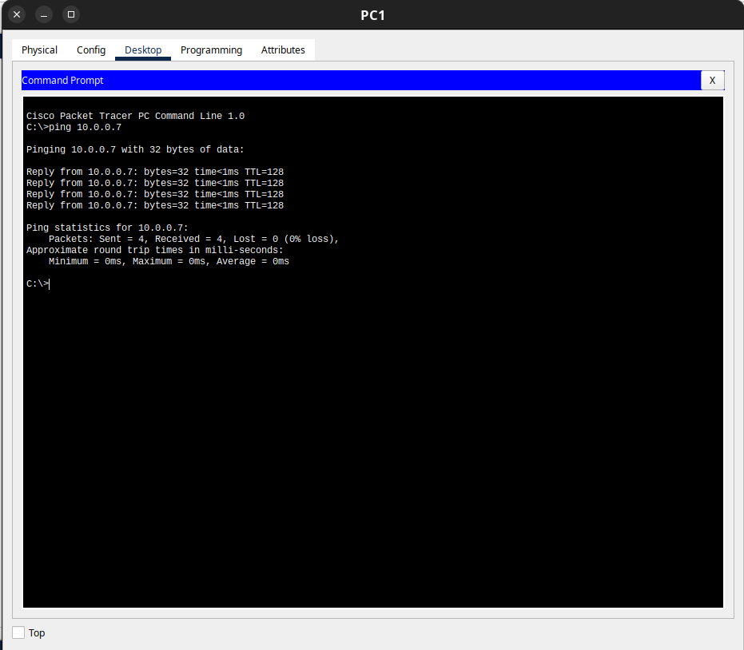
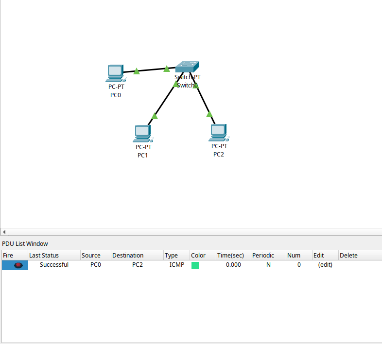
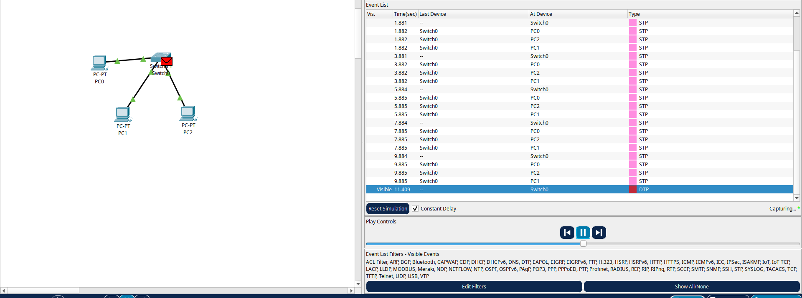

# Ponderada sobre camada física do modelo TCP/IP

## 1. Introdução

Esta atividade ponderada tem como objetivo demonstrar, por meio do Cisco Packet Tracer, o funcionamento da camada física do modelo TCP/IP. Nesse sentido, foram construídos dois cenários que permitem comparar o comportamento de dispositivos de interconexão — Hub e Switch — quanto à propagação de sinais elétricos e quadros Ethernet.

Os dois cenários utilizam a mesma topologia física — três PCs interconectados por cabos par trançado — diferindo apenas no equipamento central: no primeiro, um Hub; no segundo, um Switch.

> [Vídeo demonstrativo]()

## 2. PARTE 1 — Rede com HUB e Análise de Propagação do Sinal

### 2.1 Configuração do Cenário

O cenário foi montado no Cisco Packet Tracer conforme as especificações a seguir:

| Dispositivos | Quantidade | Observação |
|---|---|---|
| PC0, PC1 e PC2 | 3 computadores | Generic PC-PT |
| Hub | 1 unidade | Hub-PT (camada física) |
| Cabos | 3 conexões | Par trançado (straight-through) |

Figura 1 — Cenário 1 Configurado

Print da tela do PC1 no Cisco

### 2.2 Endereçamento IP

| Dispositivo | Endereço IP | Máscara de Sub-rede |
|---|---|---|
| PC0 | 10.0.0.5 | 255.0.0.0 |
| PC1 | 10.0.0.6 | 255.0.0.0 |
| PC2 | 10.0.0.7 | 255.0.0.0 |

### 2.3 Tarefas Realizadas

#### Teste de Conectividade — Ping entre todos os dispositivos

Foram realizados pings entre pares de PCs para validar a conectividade da rede:

- PC0 → PC1 (10.0.0.5 → 10.0.0.6): Sucesso
- PC1 → PC0 (10.0.0.5 → 10.0.0.7): Sucesso
- PC1 → PC2 (10.0.0.6 → 10.0.0.7): Sucesso

Figura 1 — Teste de ping  PC1 -> PC0

Print da tela do PC1 no Cisco

#### Envio de Simple PDU — PC0 para PC2

Utilizando a ferramenta Simple PDU do Cisco Packet Tracer, foi enviado um pacote do PC0 para o PC2. O resultado foi Successful.

Figura 2 — Simple PDU de PC0 para PC2

Print da tela do Cisco

#### Observação da Simulação Completa

No modo Simulation do Packet Tracer, foi possível observar a propagação dos quadros Ethernet pela rede.

Figura 4 — Simulação mostrando propagação do quadro pelo hub para todos os nós

Print da tela do Cisco

### 2.4 Análise Técnica

#### a) Por que todos os nós recebem o quadro inicialmente dentro de um hub?

 Todos os nós recebem o quadro inicialmente dentro de um hub visto que ele funciona como um repetidor elétrico multiportas, ou seja, ao receber um sinal elétrico em qualquer uma de suas portas, esse sinal é retransmitido para as demais portas, sem realizar nenhuma análise de endereçamento. 

Isso ocorre porque o hub não possui: tabela de endereços MAC, de modo que ele não sabe para qual dispositivo o quadro é destinado. Além disso, ele atua apenas no nível do sinal elétrico, sem capacidade de processar cabeçalhos Etherne.

Nesse sentido, ao enviar a PDU de PC0 para PC2, o quadro chegou também ao PC1, que o descartaria após verificar que o endereço MAC de destino no cabeçalho Ethernet não correspondia ao seu próprio endereço. 

#### b) Relação com o conceito de meio compartilhado

Em redes com hub, todos os dispositivos compartilham um único canal de comunicação no qual apenas um dispositivo pode transmitir por vez. Nesse cenário, explica-se o porquê do PC1 também receber o PDU que foi enviado para o PC2.

Desse modo, se dois dispositivos transmitirem simultaneamente, ocorre colisão; assim, o protocolo CSMA/CD detecta a colisão, interrompe as transmissões e aguarda um tempo aleatório antes de tentar novamente. Outrossim, outra questão que esse meio apresenta é a divisão da largura de banda total entre todos os nós ativos. 

Ademais, a comunicação só pode ocorrer em uma direção por vez, devido ao meio físico ser compartilhado. Por fim,  qualquer nó da rede pode capturar todos os quadros transmitidos, o que representa um risco de segurança.

## 3. PARTE 2 — Rede com SWITCH e Comparação Física

### 3.1 Configuração do Cenário

O hub foi substituído por um Switch, mantendo os mesmos PCs, endereços IP e topologia física (cabos par trançado). O arquivo [`cenario2.pkt`](./cenario2.pkt) contém este cenário.

Figura 5 — Topologia do cenário 2 com Switch

Print da tela do Cisco

### 3.2 Tarefas Realizadas

#### Estabilização das Portas

Após a inicialização, aguardou-se a estabilização das portas do switch.

Figura 6 — Portas do switch em estado Forwarding (estabilizadas

Print da tela do Cisco

#### Teste de Conectividade

Após a estabilização, os pings entre os pares confirmaram a conectividade. 

Figura 7 — Teste de ping com switch

Print da tela do Cisco

#### Envio de Simple PDU — PC0 para PC2

A Simple PDU foi enviada novamente de PC0 para PC2. 

Figura 8 — Simple PDU de PC0 para PC2 via switch

Print da tela do Cisco

#### Observação da Simulação

Figura 9 — Simulação com switch

Print da tela do Cisco

### 3.3 Análise Técnica

#### a) Comparação do fluxo do sinal elétrico: Switch versus Hub

No switch, o sinal elétrico recebido em uma porta é processado pelo ASIC (Application-Specific Integrated Circuit) interno, que extrai o quadro Ethernet, lê o endereço MAC de destino e consulta a tabela CAM. Assim, o sinal elétrico de saída é então gerado apenas na porta associada ao endereço MAC de destino.

#### b) Por que a PDU não é propagada para todos os nós no switch?

Conforme explicado, o switch mantém uma tabela CAM que associa cada endereço MAC à porta na qual o dispositivo foi detectado. 

Na simulação, o switch já conhecia as portas de PC0, PC1 e PC2. Ao receber o quadro de PC0 destinado a PC2, encaminhou-o exclusivamente para a porta de PC2, isolando completamente PC1 do tráfego.

#### c) O switch elimina o meio físico compartilhado? Justificativa técnica

O switch não elimina completamente o meio físico compartilhado, mas faz sua segmentação. Dessa forma, o canal deixa de ser compartilhado logicamente, pois cada dispositivo possui uma via própria de comunicação com o switch, permitindo que cada enlace opere em modo full-duplex. Assim, o switch estabelece enlaces ponto a ponto dedicados entre cada dispositivo e sua respectiva porta, eliminando o compartilhamento lógico do canal e os domínios de colisão, enquanto o meio físico — como cabos e sinais elétricos — continua sendo a base da transmissão.

## 4. Referências

- TANENBAUM, A. S.; WETHERALL, D. *Computer Networks*. 5. ed. Pearson, 2011.
- FOROUZAN, B. A. *Data Communications and Networking*. 5. ed. McGraw-Hill, 2013.
- CISCO NETWORKING ACADEMY. *Cisco Packet Tracer — Simulation Mode Documentation*. Cisco Systems, 2024.
- IEEE 802.3 — Ethernet Working Group. *IEEE Standard for Ethernet*. IEEE, 2022.
- STEVENS, W. R. *TCP/IP Illustrated, Volume 1: The Protocols*. 2. ed. Addison-Wesley, 2011.
